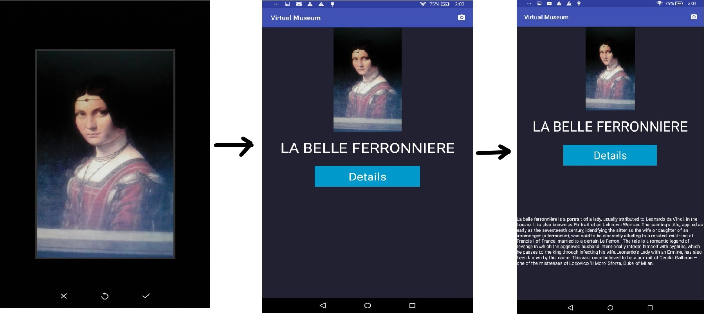

# TensorFlow - Virtual Museum

This is my university project using [TensorFlow](https://www.tensorflow.org/) library on Android to classify images. This project is inspired from a thesis paper called: [Image recognition on an
Android mobile phone](https://iiw.kuleuven.be/onderzoek/eavise/mastertheses/billiauwsbonjean.pdf)

If you're interested how the model was created, you can read about it on [TensorFlow For Poets](https://codelabs.developers.google.com/codelabs/tensorflow-for-poets/).

  

 

## Usage

Flow of the app:

1. Take a photo.
2. Classify the photo from trained model.
3. Show the results.
4. After clicking Details button, it shows details from [wikipedia api](https://en.wikipedia.org/w/api.php) & plays text to speech. If the details are not found in wikipedia, it shows no details found.

### Code structure

The app consists of two main components:

1. `MainActivity` which is responsible for taking a photo.
2. `ImageClassifier` which classifies the photo.
